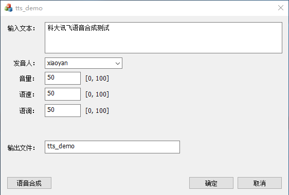

# 说明

## 运行界面：

## 程序使用说明

需要去讯飞开放平台，创建离线语音合成应用，下载对应能力的SDK。

> 目前平台用户需要实名认证，而且增加了App创建的数量。高品质的离线语音合成版本，没有windows版本SDK。

得到appid，用户名以及密码。
bin\tts.data文件中存储了appid、name、pwd信息。

+ inih\IniParser类用于ini文件的读写
+ utils\tts中对应讯飞离线语音合成SDK的主要文件。可对应更新。
+ TTS类对讯飞tts的主要操作的封装，方便使用。
+ tts生成的是wav格式音频，调用lame.exe将wav转换成mp3文件。

**程序运行，需要将utils\tts\bin中文件拷贝到bin下**
